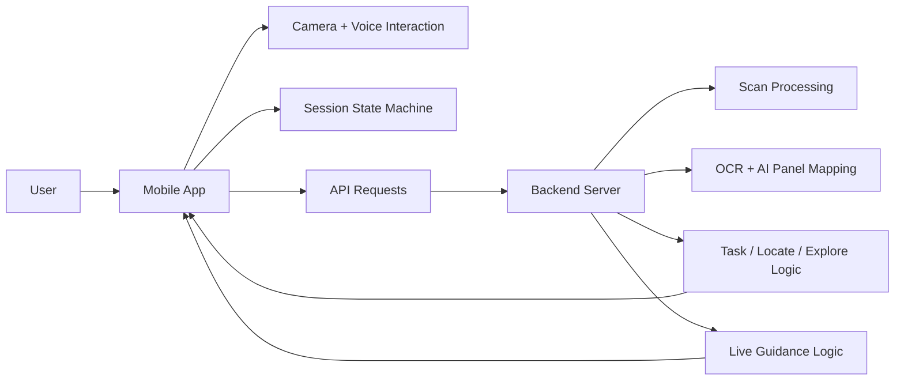
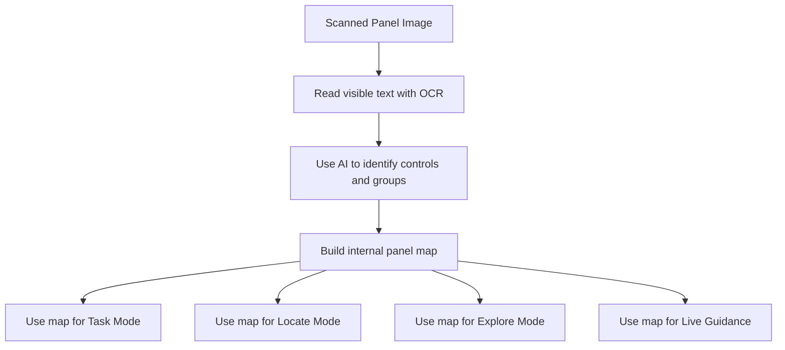
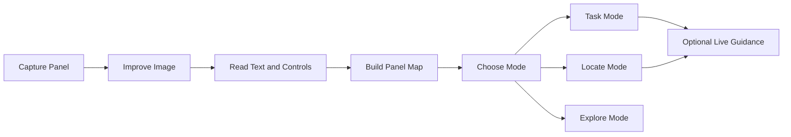
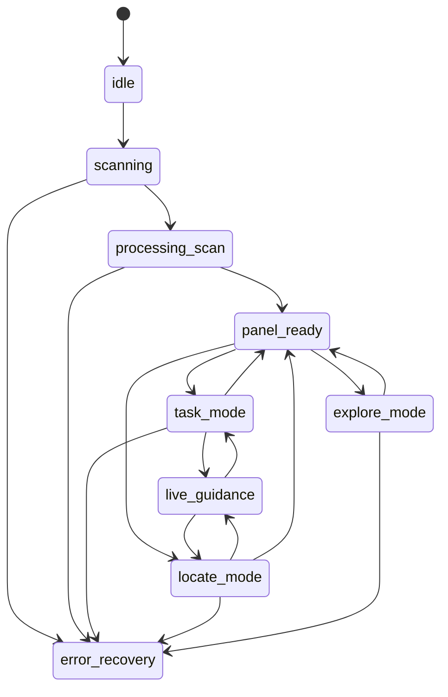
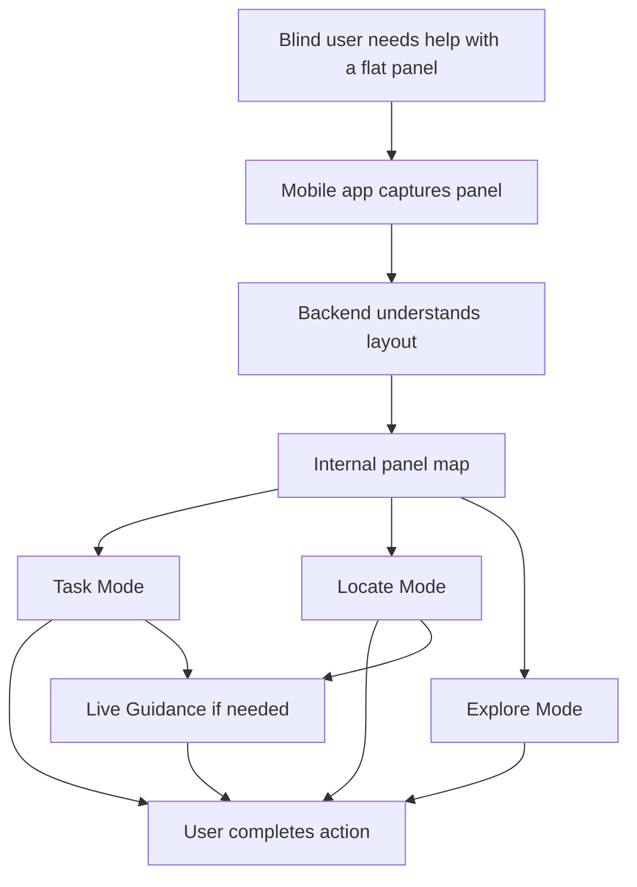

# TouchMap Design

This document explains how `TouchMap` is designed and why its structure matters. The goal of the design is to create a system that is understandable to users, reliable in real use, and complex enough to solve a difficult accessibility problem in a practical way.

The idea behind TouchMap is simple: a flat panel is hard to use because it removes the physical clues that many blind users rely on. Our design solves that problem by breaking it into stages. First, the app captures the panel. Next, it uses OCR and AI to figure out what is on the panel and how it is arranged. Finally, it helps the user complete a goal through spoken guidance.

## 1. Design Priorities

The design of TouchMap was built around four priorities:

- **Accessibility:** The system must work for users who cannot rely on sight.
- **Clarity:** The experience must be understandable to a first-time user.
- **Reliability:** The app must avoid unsafe guessing and handle failure clearly.
- **Modularity:** Each major job in the system should be handled by a separate part of the architecture so it can be tested and improved independently.

These priorities shaped every major design decision in the project.

## 2. High-Level Architecture

TouchMap uses a two-part architecture:

- A **mobile app** that handles scanning, voice interaction, screen flow, and user guidance
- A **backend server** that handles image analysis, OCR, AI-assisted panel understanding, task generation, and structured decision-making

This split makes the app easier to manage. The phone focuses on the user experience, while the backend handles the heavier reasoning and processing.

## 3. How the System Thinks About a Panel

The main design idea behind TouchMap is that the app should not treat a panel as just a picture or a list of words. Instead, it should treat the panel like a structured layout.

To do that, TouchMap uses a layered interpretation approach:

- OCR reads visible text from the panel
- AI interprets the image and OCR context together
- validation and graph logic turn that interpretation into structured guidance

For example, a microwave panel is not just a collection of labels such as `Start`, `Stop`, and `5`. It is a system with groups, positions, and relationships:

- some buttons are in a number pad
- some buttons are in an action row
- some controls are above or below others
- some tasks require a specific sequence of controls

This design choice is what makes TouchMap more advanced than a basic text-reading tool. The app builds an internal map of the panel so it can guide the user in a more useful way.

## 4. End-to-End Design Flow

The app follows a staged design so that each step builds on the one before it.

### Step 1: Capture

The mobile app helps the user take a usable picture of the panel. Instead of expecting the user to frame the image visually, the app provides spoken guidance such as "move left," "tilt down," or "hold still."

### Step 2: Processing

The backend improves the image and reads visible labels. After that, an AI layer interprets the image and OCR results together. This step prepares the panel for deeper understanding.

### Step 3: Panel Mapping

The system turns the scan into a structured panel map. This happens after OCR and AI interpretation, and it is one of the most important design decisions in the project because it allows the app to reason about the interface instead of only reading it.

### Step 4: User Mode

Once the panel is understood, the user can choose one of three modes:

- **Task Mode** for completing an action
- **Locate Mode** for finding one control
- **Explore Mode** for understanding the layout

### Step 5: Live Guidance

If the user still cannot find the correct control, the app can switch into live guidance and give real-time spoken help.

## 5. Frontend Design

The mobile app was designed to be voice-first and state-driven.

### Voice-First Interaction

The frontend is not built like a typical visually complex app. Instead, it is designed to support accessibility first:

- simple screen flow
- large, clear actions
- spoken prompts
- spoken confirmations
- repeatable instructions

### State Machine Design

One of the strongest technical parts of the design is the use of a session state machine. Instead of using loose screen changes, the app moves through clearly defined states. This makes the software easier to understand, test, and debug.

This design improves software quality because every major transition is intentional. The app always knows what state it is in, what data it should have, and what should happen next.

## 6. Backend Design

The backend was designed as a collection of focused modules rather than one large block of code. Each module has one main responsibility.

| Backend Area | Purpose |
|---|---|
| `api/routes` | Receives requests from the mobile app |
| `flows` | Runs the full scan pipeline from image to result |
| `services/scans` | Improves and prepares images |
| `services/ocr` | Reads visible text |
| `services/panelmap` | Uses AI plus OCR context to build a structured understanding of the panel |
| `services/graphs` | Organizes controls by spatial relationships |
| `services/tasks` | Generates step-by-step task guidance |
| `services/locating` | Finds a requested control |
| `services/exploration` | Describes sections of the panel |
| `services/guidance` | Provides live directional help |
| `services/sessions` | Keeps track of active scan data |

This modular structure supports strong software coding practices because each part can be developed, tested, and improved without breaking the whole system.

## 7. Why the Design Is Complex

TouchMap is complex because it is solving more than one problem at once. It is not just a camera app, not just a text reader, and not just a voice assistant. It combines several layers into one product:

1. **Scan guidance** so the user can capture the panel independently  
2. **OCR and AI-based panel understanding** so the app knows what controls exist  
3. **Layout reasoning** so the app understands where controls are  
4. **Task planning** so the app can guide the user through a goal  
5. **Mode-based interaction** so users can get the type of help they need  
6. **Live correction** so the app can recover when the first instructions are not enough  

That layered design is what gives the project both complexity and usefulness.

## 8. Why the Design Is Creative

The creativity of TouchMap comes from how it changes the role of accessibility software.

Most tools in this space stop after recognition. They can read words, but they do not turn those words into action. TouchMap is different because it combines OCR, AI interpretation, and structured logic to treat a flat panel as something that can be interpreted, organized, and used through guidance.

The most original design idea in the project is the internal panel map:

- it turns a visual layout into a spoken mental model
- it uses AI for interpretation but still validates and structures the result
- it supports multiple user modes from one shared understanding
- it allows the app to guide real tasks instead of simply describing text

This makes the design both more original and more practical.

## 9. Reliability and Error Handling by Design

TouchMap was designed to fail safely.

Instead of pretending to know the answer when the scan is weak or unclear, the system is built to recover carefully. If something goes wrong, it should:

- ask the user to rescan
- ask the user to clarify a request
- explain that a control could not be found
- stop rather than give unsafe instructions

This is an important part of the design because accessibility software must be trustworthy.

## 10. Software Coding Practices Reflected in the Design

The design supports strong software engineering in several ways:

- requirements are separated from design, implementation, and testing
- frontend and backend responsibilities are clearly divided
- major features are split into modules with single responsibilities
- the state machine creates predictable app behavior
- the backend uses structured routes and services instead of mixed logic
- testing can be mapped directly to modules such as task planning, locating, exploring, and panel validation

This matters because a well-designed system is easier to build correctly and easier to explain to judges.

## 11. Technical Skill Reflected in the Design

The technical skill of the project is visible in how the pieces fit together logically:

- the phone handles user interaction and accessibility
- the backend handles processing and reasoning
- the panel map connects scan results to all later features
- the same structured understanding supports task help, locating, exploring, and live guidance
- the app flow is controlled through explicit state transitions rather than loose navigation

This creates a design that is both advanced and organized.

## 12. Visual Summary

In short, the design of TouchMap is built to be accessible, modular, creative, and highly functional. It turns a difficult real-world accessibility problem into a structured software system that is easier to understand, easier to test, and more useful to the end user.
