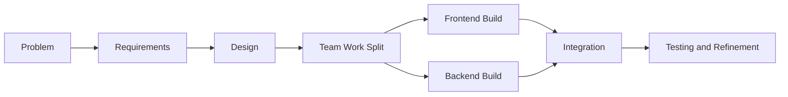
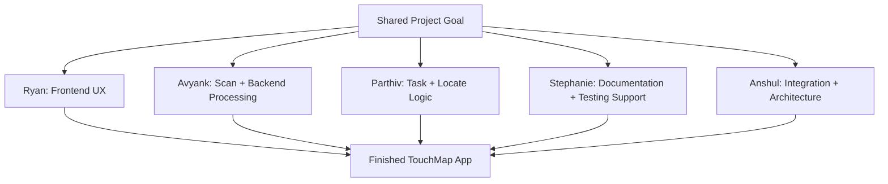
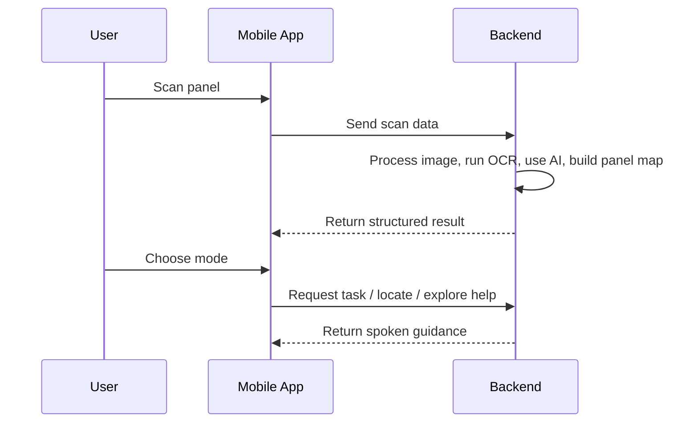
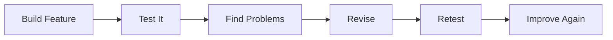

# TouchMap Implementation

This document explains how we built `TouchMap` as a team. While the design document focuses on the system itself, this section focuses on our implementation process: how we divided the work, what tools we used, how we collaborated, and how we turned the original idea into a working project.

Our goal during implementation was not just to make something that worked once. We wanted a build process that was organized, collaborative, and solid enough to hold up as the project grew.

## 1. How We Approached the Build

We built TouchMap in stages so that the project stayed organized and manageable.

1. We started with the real-world problem: blind users often cannot use flat panels independently.
2. We translated that problem into requirements such as guided scanning, panel understanding, task help, locating controls, and live guidance.
3. We designed the system before fully building it, so each major feature had a clear purpose.
4. We divided the work across the team based on major project areas.
5. We built the mobile app and backend in parallel, then connected them through shared workflows.
6. We refined the product through repeated testing, debugging, and revision.

This step-by-step process kept us from building in a scattered way and made the project easier to explain, maintain, and improve.

## 2. Tools We Used

To build the project efficiently and collaboratively, we used a set of standard software development tools:

- **VSCode** for writing and organizing code
- **GitHub** for version control, saving progress, and collaborating across team members
- **Python** and **FastAPI** for the backend
- **React Native / Expo** for the mobile app
- **OCR and AI services** for panel interpretation and task understanding
- **Markdown documentation** for organizing requirements, design, implementation, testing, and setup

Using VSCode and GitHub was especially important because they helped us work like a real development team instead of as five people editing files separately. GitHub allowed us to keep track of changes, combine work from different people, and avoid losing progress.

## 3. How We Split Up the Work

We divided the work by major project responsibilities so each team member could focus on a clear area while still contributing to the overall product.

| Team Member | Main Implementation Responsibility |
|---|---|
| Ryan | Frontend user experience, navigation flow, and accessibility-focused screen design |
| Avyank | Scan pipeline, image handling, and backend processing work |
| Parthiv | Task Mode, Locate Mode, and action-based guidance logic |
| Stephanie | Documentation quality, requirement organization, and testing support |
| Anshul | System integration, architecture coordination, live guidance, and final project alignment |

This split helped in two ways:

- it allowed people to work in parallel instead of waiting on one another
- it gave each major part of the app a clear owner

At the same time, the project still required coordination because the final product depends on all parts working together.

## 4. How We Built the Frontend

The frontend implementation focused on the user experience. Since TouchMap is an accessibility project, the mobile app could not just look good. It had to be understandable and supportive for someone who may not be able to rely on sight.

During implementation, the frontend work focused on:

- building the main screens for scanning, mode selection, task help, locating, exploring, and live guidance
- keeping the app flow simple and consistent
- making sure spoken instructions were central to the experience
- making it easy to move forward, go back, rescan, or recover from errors

One implementation choice was to organize the app around a defined state flow instead of ad hoc screen switching. This gave the app a fixed sequence of states and transitions for the main user flow.

## 5. How We Built the Backend

The backend implementation focused on the logic that makes the app intelligent.

Instead of putting all of the project logic into one large file, we split the backend into focused parts. This allowed us to build and test different parts of the system more clearly.

The backend work included:

- receiving scan data from the mobile app
- improving and reading panel images
- using OCR to detect visible labels
- using AI to interpret the image and OCR results together
- identifying visible controls and labels
- turning scan results into a structured panel map
- generating task instructions
- locating specific controls
- describing sections of the layout
- supporting live guidance and session handling

This modular approach kept each part of the backend focused on one job.

## 6. How We Connected the Pieces

One part of implementation was integration across the phone app, backend, and guidance logic.

Our implementation workflow looked like this:

1. The mobile app captures a panel.
2. The app sends the panel data to the backend.
3. The backend preprocesses the image, runs OCR, uses AI to interpret the panel, and creates a structured result.
4. The result is sent back to the mobile app.
5. The user then chooses `Task Mode`, `Locate Mode`, or `Explore Mode`.
6. If needed, the app can move into live guidance.

This flow helped the team keep the system consistent from beginning to end.

## 7. How We Used GitHub in Practice

GitHub was a major part of our implementation process, not just a place to store code.

We used it to:

- keep a shared version of the project
- save progress regularly
- combine work from multiple people
- review project structure and file organization
- avoid conflicts when multiple parts were being built at once

That mattered because TouchMap was not a one-file project. It included multiple screens, backend routes, services, and documentation files. GitHub helped us manage that complexity without losing track of work.

After the project was finalized, we moved the completed version into a new production GitHub repository. We did this to avoid confusion between draft work, experimental changes, and the polished final version of the project. This helped keep the final submission cleaner, easier to review, and better organized for presentation.

## 8. How We Iterated

TouchMap was built through repeated improvement, not in one straight line.

As we implemented the project, we often learned that a feature needed to be adjusted. For example:

- a scan flow might need clearer guidance
- a spoken instruction might need simpler wording
- a screen might need to be easier to navigate
- a feature might need stronger error handling
- the connection between the app and backend might need refinement
- larger methods might need to be split into smaller helper methods
- repeated numeric values might need to be replaced with named constants

That iteration helped us turn rough ideas into features that were clearer and more reliable.

## 9. Software Coding Practices in Implementation

The implementation also reflects a few software coding practices that helped keep the project organized:

- we separated the project into requirements, design, implementation, testing, and setup documentation
- we divided major system jobs into focused modules
- we split responsibilities across team members
- we used version control through GitHub
- we built the app and backend as connected but separate parts
- we refined the product through iteration instead of treating the first version as finished
- we improved maintainability by refactoring complex services into smaller methods
- we replaced magic numbers with named constants so important thresholds are easier to understand

These choices contributed to the structure and maintainability of the implementation.

## 10. System Integration

The implementation can also be described in terms of how the system was assembled:

- the mobile app and backend were built as separate but coordinated systems
- the AI layer was integrated into the system as one stage, not as the entire app
- the app supports multiple user modes from one shared scan result
- the implementation supports both step-by-step guidance and real-time fallback guidance
- the structure of the project supports future testing and expansion

This section describes how the main parts of the system were connected.