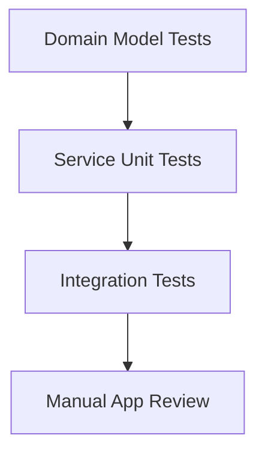
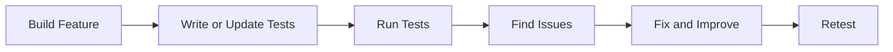

# TouchMap Testing

This document explains how we tested `TouchMap` and how our testing process connects directly to the `tests/` folder in the repository. The purpose of this section is to show that TouchMap was not only designed and built carefully, but also verified in a structured way.

Testing was especially important for this project because TouchMap is an accessibility app. If the app gives unclear or incorrect guidance, it does not just create inconvenience. It affects the user’s confidence and independence. Because of that, we focused our testing on reliability, clarity, safe failure, and logical system behavior.

This was especially important because TouchMap includes an AI interpretation layer. That meant we needed to verify not just that AI was used, but that its output was cleaned, validated, and checked before being turned into user guidance.

## 1. Testing Goals

Our testing process focused on four goals:

- **Correctness:** Make sure core features behave as expected
- **Reliability:** Make sure the app handles missing or unclear data safely
- **Maintainability:** Make sure individual parts can be tested independently
- **Confidence:** Make sure the project can be demonstrated as a real software product, not just a concept

These goals connect directly to the rubric because they show strong software coding practices, technical skill, and a more complete product.

## 2. Where the Tests Are

All project tests are organized under the `tests/` directory.

```text
tests/
|-- README.md
`-- backend/
    |-- conftest.py
    |-- integration/
    |   |-- test_api_health.py
    |   `-- test_scan_pipeline.py
    `-- unit/
        |-- domain/
        |   |-- test_panel_map_models.py
        |   `-- test_task_models.py
        `-- services/
            |-- test_explore.py
            |-- test_graph_construction.py
            |-- test_intent_parsing.py
            |-- test_locate.py
            |-- test_panelmap_validation.py
            `-- test_task_planning.py
```

This structure reflects good software coding practice because the tests are not mixed randomly into the project. They are separated by purpose:

- `integration/` tests the system working across major boundaries
- `unit/` tests smaller individual parts
- `conftest.py` provides shared fixtures for reusable test data

## 3. Our Testing Strategy

We tested TouchMap in layers rather than relying on only one kind of test.



### Layer 1: Domain Model Tests

We tested the project’s core data structures first. This included items such as:

- bounding boxes
- controls
- panel maps
- task plans

This matters because TouchMap depends on the app understanding a panel in a structured way. If the underlying models are wrong, every feature built on top of them becomes less reliable.

### Layer 2: Service Unit Tests

We tested the main services that perform the project’s reasoning:

- intent parsing
- task planning
- locate logic
- explore logic
- panel map validation
- control graph construction

Testing these services individually helped us verify that each important feature works on its own before being connected into the full system.

This was especially valuable for the AI-related parts of the project because it let us test what happens after AI interpretation, including validation, cleanup, graph construction, and fallback behavior.

### Layer 3: Integration Tests

We also tested the backend as a connected system through API-level tests. This included:

- the health endpoint
- the scan pipeline endpoint

These tests are important because they confirm that the backend can receive a request, process it, and return a meaningful response.

### Layer 4: Manual App Review

In addition to automated tests, we reviewed the app manually by checking:

- scan flow clarity
- spoken guidance wording
- screen-to-screen transitions
- recovery from failed scans or unclear requests

This manual layer matters because TouchMap is an accessibility product, and not every user experience detail can be measured through backend tests alone.

## 4. What We Tested in `tests/backend/unit/domain`

The files in `tests/backend/unit/domain/` verify the project’s core data structures.

### `test_panel_map_models.py`

This file tests:

- bounding box math
- overlap logic
- coordinate validation
- control matching
- region lookup
- graph neighbor lookup

This is important because TouchMap relies on understanding where controls are and how they relate to one another.

### `test_task_models.py`

This file tests:

- task step access
- task step counts
- basic task plan behavior

These tests help confirm that task guidance is built on a stable structure.

## 5. What We Tested in `tests/backend/unit/services`

The files in `tests/backend/unit/services/` cover the project’s most important logic.

### `test_intent_parsing.py`

This verifies that user requests such as "set the microwave for 60 seconds" are turned into the correct meaning. It also checks generic commands like start and stop.

### `test_task_planning.py`

This verifies that the app can turn a user goal into a usable step-by-step plan. It checks:

- time conversion
- correct action sequence
- fallback behavior when controls are missing

### `test_locate.py`

This verifies that the system can find controls by:

- exact name
- different capitalization
- aliases such as `begin` for `Start`
- partial matches
- unknown queries

This matters because real users may not always use the exact label printed on the appliance.

### `test_explore.py`

This verifies that the app can describe:

- the whole panel
- a number pad
- top or bottom rows
- left or right side areas
- unknown requests with fallback behavior

This supports the project’s originality because Explore Mode is one of the key features that goes beyond simple text reading.

### `test_panelmap_validation.py`

This verifies that the system can clean and normalize scan results by checking:

- duplicate removal
- label cleanup
- alias filling
- type inference
- confidence calculation

This is a major reliability feature because it improves raw scan output before the rest of the system uses it. It is especially important because TouchMap uses AI to interpret panel layouts, so the project must validate that output before trusting it.

### `test_graph_construction.py`

This verifies that the project can build a useful spatial graph of the panel by checking:

- row assignment
- column assignment
- left/right/above relationships
- adjacency
- region membership
- spoken spatial descriptions

This test file is especially important because the control graph is one of the most complex parts of the project.

## 6. What We Tested in `tests/backend/integration`

The files in `tests/backend/integration/` test the backend as a running system.

### `test_api_health.py`

This confirms that the API starts correctly and that the health route responds with a valid success result.

### `test_scan_pipeline.py`

This confirms that the scan route can accept a test image and process it through the backend pipeline. That pipeline includes preprocessing, OCR, AI-assisted panel understanding, validation, and response handling. Even when some external dependencies vary by environment, the test still verifies that the endpoint behaves in a controlled and expected way.

This is important because it connects testing to the real workflow of the product instead of only testing isolated logic.

## 7. Shared Fixtures and Reusability

The file `tests/backend/conftest.py` helps the test suite stay organized by providing shared sample data, including:

- sample controls
- sample regions
- sample panel maps
- sample control graphs
- sample task intents

This reflects strong software coding practice because it avoids rewriting the same setup code in every file. It also makes the tests easier to read, easier to maintain, and easier to expand.

## 8. How Testing Supports the Rubric

### Creativity

The testing process supports creativity because we did not stop at testing simple input and output. We tested original features that are specific to TouchMap, such as:

- spatial control finding
- layout exploration
- AI-assisted panel interpretation
- panel map building
- task guidance from real user goals

These are not generic app features. They reflect the originality of the project itself.

### Software Coding Practices

The testing structure supports strong software coding practices because:

- tests are organized in a separate `tests/` directory
- unit and integration tests are clearly separated
- shared fixtures are reused through `conftest.py`
- tests map directly to requirements and design modules
- core logic is testable in isolation
- AI output is not trusted blindly; it is checked through validation-oriented testing

This shows that the project was developed with planning, organization, and maintainability in mind.

### Complexity

The testing process also highlights the project’s complexity. TouchMap is not testing one small feature. The test suite covers:

- data models
- layout reasoning
- OCR and AI-assisted panel understanding
- task planning
- user query interpretation
- control location logic
- explore descriptions
- API behavior

This range of coverage reflects a complex system with many interacting parts.

### Technical Skill

The test suite demonstrates technical skill because it verifies both small logic units and larger workflows. It also shows that the team understood how to:

- write reusable fixtures
- validate structured data
- test API routes
- simulate workflow behavior
- check fallback behavior for uncertain cases
- verify that AI-assisted outputs are validated before they drive user guidance

This makes the project more credible as a complete software product.

## 9. Testing Workflow

Our testing workflow followed a clear pattern:

1. Build a feature
2. Test the logic for that feature
3. Connect the feature to the larger system
4. Test the integrated behavior
5. Revise based on what we learned



This workflow helped us catch problems earlier and improve the project more confidently.

## 10. Limitations and Honest Reflection

The current automated tests are strongest on the backend, where most of the system’s reasoning happens. This was a deliberate priority because the backend contains the project’s most important logic: panel understanding, task generation, control locating, and reliability checks.

Frontend behavior was also reviewed manually, especially for accessibility flow and clarity, but the strongest automated coverage today is in `tests/backend/`.

Including this honest reflection is important because strong testing is not about pretending everything is perfect. It is about showing that the team understands what has been verified, what has been prioritized, and why.

## 11. Final Testing Reflection

The `tests/` folder is one of the strongest pieces of evidence that TouchMap was built as a real software project. It shows that we did not only create features. We also verified them in a structured way.

By connecting the tests to domain models, services, integration routes, and real project workflows, our testing process strengthens every part of the rubric:

- it supports creativity by validating original features
- it supports software coding practices by showing organized, reusable tests
- it supports complexity by covering many connected parts of the system
- it supports technical skill by demonstrating layered verification of logic and workflows

In short, testing helped turn TouchMap from an idea into a more trustworthy, polished, and demonstrable product.
