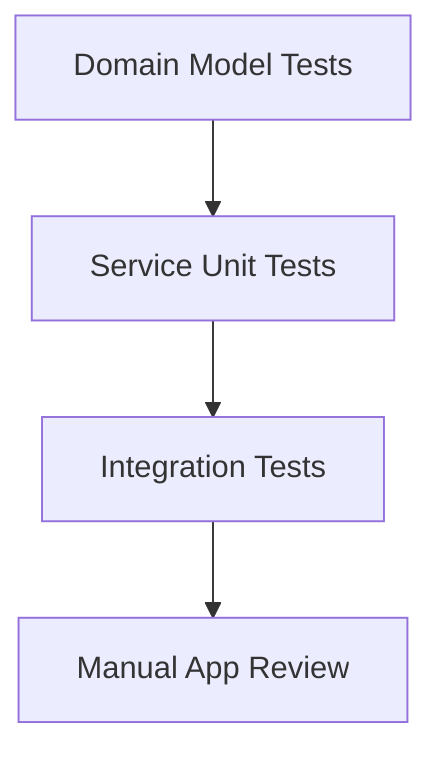
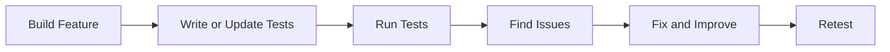

# TouchMap Testing

This document explains how we tested `TouchMap` and how that work connects to the `tests/` folder in the repository.

Testing was especially important for this project because TouchMap is an accessibility app. If the app gives unclear or incorrect guidance, it does not just create inconvenience. It affects the user’s confidence and independence. Because of that, we focused our testing on reliability, clarity, safe failure, and logical system behavior.

This mattered even more because TouchMap includes an AI interpretation layer. We needed to make sure the output was cleaned, validated, and checked before it was turned into user guidance.

## 1. Testing Goals

Our testing process focused on four goals:

- **Correctness:** Make sure core features behave as expected
- **Reliability:** Make sure the app handles missing or unclear data safely
- **Maintainability:** Make sure individual parts can be tested independently
- **Confidence:** Show that the project works like a real product, not just a concept

These goals also match what the product needed: reliable behavior, safer failure handling, and confidence that the core features actually work.

## 2. Where the Tests Are

All project tests are organized under the `tests/` directory.

```text
tests/
|-- conftest.py
|-- integration/
|   |-- test_api_health.py
|   `-- test_scan_pipeline.py
`-- unit/
    |-- domain/
    |   |-- test_panel_map_models.py
    |   `-- test_task_models.py
    `-- services/
        |-- test_explore.py
        |-- test_graph_construction.py
        |-- test_intent_parsing.py
        |-- test_locate.py
        |-- test_panelmap_validation.py
        `-- test_task_planning.py
```

The tests are separated by purpose instead of being mixed into the project:

- `integration/` tests the system working across major boundaries
- `unit/` tests smaller individual parts
- `conftest.py` provides shared fixtures for reusable test data

## 3. Our Testing Strategy

We tested TouchMap in layers rather than relying on only one kind of test.



### Layer 1: Domain Model Tests

We tested the project’s core data structures first. This included items such as:

- bounding boxes
- controls
- panel maps
- task plans

If the underlying models are wrong, every feature built on top of them becomes less reliable.

### Layer 2: Service Unit Tests

We tested the main services that perform the project’s reasoning:

- intent parsing
- task planning
- locate logic
- explore logic
- panel map validation
- control graph construction

Testing these services individually helped us verify that each important feature works on its own before being connected into the full system.

This was especially useful for the AI-related parts of the project because it let us test what happens after interpretation, including validation, cleanup, graph construction, and fallback behavior.

### Layer 3: Integration Tests

We also tested the backend as a connected system through API-level tests. This included:

- the health endpoint
- the scan pipeline endpoint

These tests are important because they confirm that the backend can receive a request, process it, and return a meaningful response.

### Layer 4: Manual App Review

In addition to automated tests, we reviewed the app manually by checking:

- scan flow clarity
- spoken guidance wording
- screen-to-screen transitions
- recovery from failed scans or unclear requests

This manual layer matters because TouchMap is an accessibility product, and not every user experience detail can be measured through backend tests alone.

## 4. What We Tested in `tests/unit/domain`

The files in `tests/unit/domain/` verify the project’s core data structures.

### `test_panel_map_models.py`

This file tests:

- bounding box math
- overlap logic
- coordinate validation
- control matching
- region lookup
- graph neighbor lookup

TouchMap relies on understanding where controls are and how they relate to one another.

### `test_task_models.py`

This file tests:

- task step access
- task step counts
- basic task plan behavior

These tests help confirm that task guidance is built on a stable structure.

## 5. What We Tested in `tests/unit/services`

The files in `tests/unit/services/` cover the project’s most important logic.

### `test_intent_parsing.py`

This verifies that user requests such as "set the microwave for 60 seconds" are turned into the correct meaning. It also checks generic commands like start and stop.

### `test_task_planning.py`

This verifies that the app can turn a user goal into a usable step-by-step plan. It checks:

- time conversion
- correct action sequence
- fallback behavior when controls are missing

### `test_locate.py`

This verifies that the system can find controls by:

- exact name
- different capitalization
- aliases such as `begin` for `Start`
- partial matches
- unknown queries

Real users may not always use the exact label printed on the appliance.

### `test_explore.py`

This verifies that the app can describe:

- the whole panel
- a number pad
- top or bottom rows
- left or right side areas
- unknown requests with fallback behavior

Explore Mode is one of the more distinctive parts of the project, so it made sense to test it directly.

### `test_panelmap_validation.py`

This verifies that the system can clean and normalize scan results by checking:

- duplicate removal
- label cleanup
- alias filling
- type inference
- confidence calculation

This improves raw scan output before the rest of the system uses it. That matters even more because TouchMap relies on AI to interpret panel layouts, so we do not want to trust that output blindly.

### `test_graph_construction.py`

This verifies that the project can build a useful spatial graph of the panel by checking:

- row assignment
- column assignment
- left/right/above relationships
- adjacency
- region membership
- spoken spatial descriptions

This test file is especially important because the control graph is one of the most complex parts of the project.

## 6. What We Tested in `tests/integration`

The files in `tests/integration/` test the backend as a running system.

### `test_api_health.py`

This confirms that the API starts correctly and that the health route responds with a valid success result.

### `test_scan_pipeline.py`

This confirms that the scan route can accept a test image and process it through the backend pipeline. That pipeline includes preprocessing, OCR, AI-assisted panel understanding, validation, and response handling. Even when some external dependencies vary by environment, the test still verifies that the endpoint behaves in a controlled and expected way.

It tests the real product flow instead of only isolated logic.

## 7. Shared Fixtures and Reusability

The file `tests/conftest.py` helps the test suite stay organized by providing shared sample data, including:

- sample controls
- sample regions
- sample panel maps
- sample control graphs
- sample task intents

It avoids repeating the same setup code in every file and makes the tests easier to read, maintain, and extend.

## 8. Testing Workflow

Our testing workflow followed a clear pattern:

1. Build a feature
2. Test the logic for that feature
3. Connect the feature to the larger system
4. Test the integrated behavior
5. Revise based on what we learned



This workflow was used to identify issues and retest after changes.

## 9. Final Testing Reflection

The `tests/` folder documents how the project features were verified through structured unit and integration tests.

By connecting the tests to domain models, services, integration routes, and real project workflows, the testing process strengthens the product in a few clear ways:

- it checks original features like panel exploration, locating controls, and task guidance
- it keeps the codebase easier to maintain through organized and reusable tests
- it covers many connected parts of the system instead of only isolated pieces
- it verifies both core logic and full workflows, not just one or the other

Overall, testing helped turn TouchMap from an idea into a more trustworthy and demonstrable product.
