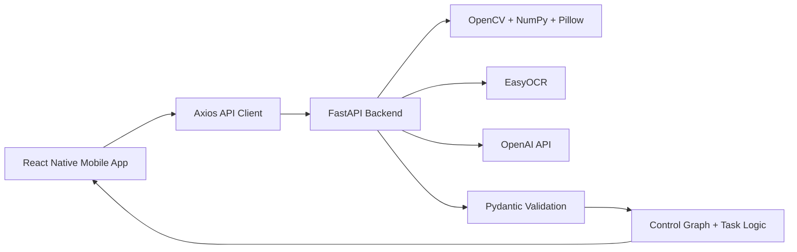
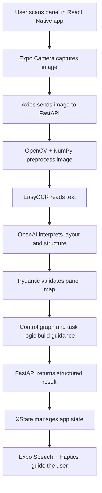

# TouchMap Tech Stack

This document explains the technology stack behind `TouchMap`, why we picked each major tool, and how the pieces fit together.

For TouchMap, the tech stack mattered because the project had to solve several different problems at once:

- build a mobile app that blind users can operate
- capture and process real panel images
- understand layout and text from those images
- turn that understanding into guidance
- keep the full system modular, testable, and maintainable

Each part of the stack was picked to solve a specific challenge in the project.

## 1. Full Stack Overview

TouchMap uses a layered stack:

- **Frontend:** React Native + Expo + TypeScript
- **Backend:** Python + FastAPI
- **Image Processing:** OpenCV + NumPy + Pillow
- **OCR:** EasyOCR
- **AI Reasoning:** OpenAI API
- **Data Modeling / Validation:** Pydantic
- **State Flow:** XState
- **Networking:** Axios + HTTP REST endpoints
- **Storage / Persistence:** AsyncStorage on mobile and session/database support on backend
- **Testing:** Pytest + HTTPX
- **Version Control / Development Tools:** GitHub + VSCode

## 2. Frontend Stack

The frontend is responsible for the user experience. Since TouchMap is an accessibility product, this part of the stack had to support a voice-first, mobile-first workflow.

### React Native

We used **React Native** because TouchMap needed to run on a phone. The phone already provides the camera, audio output, and portability the project depends on.

We specifically used React Native because it allowed us to:

- build an actual mobile interface rather than a desktop prototype
- create multiple screens for scan, task, locate, explore, and guidance flows
- keep the experience centered on real device interaction

### Expo

We used **Expo** because it made mobile development faster and easier to manage. TouchMap depends on device features such as:

- camera access
- speech output
- haptics
- app testing on mobile hardware

Expo gave us a strong framework for using those capabilities while keeping development more manageable.

### TypeScript

We used **TypeScript** because TouchMap passes structured data between many parts of the app and backend, and types helped catch mistakes earlier.

That was especially helpful for:

- scan responses
- panel data
- task plans
- locate and explore results
- live guidance data

Using typed data improved reliability and made the frontend easier to maintain.

### XState

We used **XState** to manage the app’s flow because TouchMap is not a simple single-screen app. It moves through a chain of states such as:

- idle
- scanning
- processing
- panel ready
- task mode
- locate mode
- explore mode
- live guidance
- error recovery

XState made the app’s behavior explicit instead of relying on loose navigation logic. That made the flow easier to reason about and test.

### Axios

We chose **Axios** for communication between the mobile app and backend because it gave us:

- simple HTTP request handling
- file upload support for scan images
- timeout configuration
- structured error handling

That kept communication with the backend clean and organized.

### Expo Speech

Voice output is one of the core parts of the project, so we used **Expo Speech** for:

- scan guidance
- task steps
- locate directions
- explore descriptions
- error messages

This tool fit the accessibility needs of the project directly.

### Expo Haptics

We chose **Expo Haptics** to add tactile feedback. Since TouchMap supports blind users, spoken output alone is not always enough. Haptic feedback reinforces:

- selections
- success states
- warnings
- errors
- live guidance changes

This improved accessibility and made the app easier to use.

### AsyncStorage

We used **AsyncStorage** for lightweight on-device persistence of temporary session-related information and history.

## 3. Backend Stack

The backend is where TouchMap performs most of its deeper processing and decision-making.

### Python

We chose **Python** because it works especially well for:

- image processing
- OCR
- AI integration
- structured backend services
- rapid iteration on complex logic

Python was a strong fit because TouchMap combines accessibility logic with image-based reasoning, and Python has a powerful ecosystem for those needs.

### FastAPI

We chose **FastAPI** because it allowed us to build a clean API with clearly separated routes for:

- scanning
- task planning
- locating
- exploring
- guidance
- health and debug support

FastAPI was a particularly strong choice because it combines:

- strong structure
- good performance
- easy request/response modeling
- automatic validation support through Pydantic

That helped keep the backend organized as the project grew more complex.

### Uvicorn

We used **Uvicorn** to run the FastAPI app. This gave us a practical local development server for testing the backend while building and debugging the project.

## 4. Image and Vision Stack

TouchMap begins with a panel image, so the vision stack is one of the main parts of the system.

### OpenCV

We used **OpenCV** for image preprocessing. In TouchMap, OpenCV supports:

- resizing
- basic orientation correction
- contrast improvement
- glare reduction
- panel cropping

Raw camera images are often imperfect, so cleanup helps the later steps work more reliably.

### NumPy

We chose **NumPy** because image data is ultimately numerical data. NumPy works naturally with OpenCV and supports efficient processing of image arrays.

It helps the backend handle image transformations cleanly and efficiently.

### Pillow

We chose **Pillow** as a useful fallback and image utility library. It helped support image creation and handling in places where lightweight image operations were needed, including test-related workflows.

## 5. Text Recognition and AI Stack

TouchMap needed more than one kind of intelligence. It needed both raw text reading and higher-level reasoning.

### EasyOCR

We chose **EasyOCR** because the project needs to read visible labels from real control panels. EasyOCR was a strong fit because it can detect text directly from images and return both:

- the text itself
- where that text appears on the panel

That position information matters because TouchMap needs to know not just what a button says, but where it is.

### OpenAI API

We used the **OpenAI API** where the project needed higher-level interpretation rather than simple pattern matching. Specifically, it is used for:

- turning OCR and image context into a structured panel map
- helping parse ambiguous user requests when rules are not enough
- supporting advanced interpretation in guidance-related workflows

We did not use AI as a general-purpose black box. We used it only where flexible interpretation was actually needed.

That distinction is important:

- **EasyOCR** reads text
- **OpenAI** interprets meaning and structure
- **Deterministic logic** handles planning and graph reasoning after that

That layered approach is more controlled than sending everything to one model and accepting whatever comes back.

## 6. Structured Data and Validation Stack

### Pydantic

We chose **Pydantic** because TouchMap depends on structured data passing through many layers. Pydantic helps validate and organize:

- panel maps
- controls
- spatial edges
- task intents
- task plans
- API requests and responses

Strong data modeling made the app easier to debug, test, and extend.

Pydantic also supports a better engineering process because it catches invalid data early instead of allowing silent failures later.

### Pydantic Settings

We used **Pydantic Settings** to manage environment-based configuration such as:

- API prefix
- OpenAI model settings
- OCR settings
- upload directory
- database configuration

This keeps environment-specific settings separate from the application logic.

## 7. Maintainability Choices in the Code

Beyond choosing frameworks, we also made code-level stack decisions that improved readability and maintainability.

- preprocessing thresholds were moved into named constants instead of being left as unexplained numbers
- spatial graph thresholds and layout boundaries were given explicit constant names
- larger service methods were broken into smaller helper methods
- repeated logic was grouped into reusable utility methods

These choices made the code easier to read, debug, and improve.

## 8. Storage and Persistence Stack

### SQLite + SQLAlchemy + Aiosqlite

The backend includes support for **SQLite**, **SQLAlchemy**, and **Aiosqlite**. These technologies were chosen because they provide a practical path for persistence without requiring a large production database setup.

- **SQLite** is lightweight and appropriate for a student project
- **SQLAlchemy** provides structured database access
- **Aiosqlite** supports asynchronous use in the backend environment

Even though TouchMap currently relies heavily on in-memory session behavior for the demo flow, this stack leaves room for future persistence.

### In-Memory Session Store

We also used an **in-memory session store** because TouchMap needs to keep the current scan, panel map, graph, and mode-related context available during an active user session.

For the prototype, this kept the live flow simpler while still supporting a multi-step user experience.

## 9. Testing and Quality Stack

### Pytest

We chose **Pytest** because it is a strong testing framework for Python and made it practical to test:

- domain models
- service logic
- integration routes
- scan workflow behavior

It also shows that the backend logic was built in a testable way.

### HTTPX

We used **HTTPX** for integration testing of backend routes. This made it possible to verify API behavior in a realistic but controlled way.

TouchMap is an interacting system, and route-level testing helps confirm that those pieces work together correctly.

## 10. Development Workflow Tools

### VSCode

We chose **VSCode** because it provided a practical environment for writing, organizing, and debugging a multi-part codebase with both frontend and backend code.

### GitHub

We chose **GitHub** because TouchMap was built as a team project. GitHub helped us:

- save progress
- share code
- combine work from multiple team members
- maintain a structured repository

Managing the project well mattered too, not just writing code.

## 11. How the Stack Worked Together

The TouchMap tech stack is defined not by any one tool by itself, but by how the tools connect.

This flow shows how the stack operates as a connected system:

- each technology has a specific job
- the system moves from raw image input to structured guidance in clear stages
- AI is used carefully, not blindly
- typed models and validation keep the system organized
- the frontend and backend cooperate through a clean API boundary

## 12. Why This Stack Works

TouchMap's stack is defined by how its components were chosen and combined.

This project uses the stack to:

- combines mobile development, backend engineering, image processing, OCR, AI reasoning, and structured validation
- separates concerns instead of mixing all logic together
- uses different technologies for the jobs they do best
- builds a pipeline where each stage improves the reliability of the next stage
- supports accessibility at the interface level, not just the algorithm level

In other words, the stack uses multiple tools with defined roles and explicit connections between stages.

Overall, the tech stack supports the full TouchMap workflow from image capture and interpretation to structured guidance and user feedback.