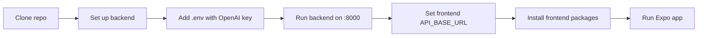

# TouchMap Local Setup

This document explains how to set up `TouchMap` on a new computer so the project can run locally. These steps are written for someone who wants to recreate the project environment, install the required tools, and launch both the backend and mobile app.

## 1. What You Need First

Before starting, install the following:

- **Python 3.11 or newer**
- **Node.js 18 or newer**
- **Git**
- **VSCode** or another code editor
- **Expo Go** on a phone, or an Android/iOS emulator
- An **OpenAI API key** for the AI-powered panel interpretation features

TouchMap uses both a backend and a mobile frontend, so both Python and Node.js are required.

## 2. Clone the Project

Open a terminal and clone the repository:

```bash
git clone <your-repository-url>
cd "TSA Software Development"
```

If you already have the project folder, open that folder instead.

## 3. Backend Setup

The backend handles image processing, OCR, AI interpretation, task planning, locating, exploring, and live guidance support.

### Step 1: Create a virtual environment

From the project root:

```bash
cd backend
python -m venv venv
```

### Step 2: Activate the virtual environment

On **Windows PowerShell**:

```bash
venv\Scripts\Activate.ps1
```

On **Windows Command Prompt**:

```bash
venv\Scripts\activate
```

On **macOS / Linux**:

```bash
source venv/bin/activate
```

### Step 3: Install backend dependencies

```bash
pip install -r requirements.txt
```

This installs the backend stack, including:

- FastAPI
- OpenCV
- EasyOCR
- OpenAI
- Torch / TorchVision
- Pytest

### Step 4: Create a `.env` file

Inside the `backend/` folder, create a file named `.env`.

Add at least:

```env
OPENAI_API_KEY=your_openai_api_key_here
OPENAI_MODEL=gpt-4o
DEBUG=False
LOG_LEVEL=INFO
```

You can also add optional settings if you want to customize the environment:

```env
API_V1_PREFIX=/api/v1
DATABASE_URL=sqlite+aiosqlite:///./touchmap.db
UPLOAD_DIR=./uploads
OCR_CONFIDENCE_THRESHOLD=0.3
MAX_IMAGE_SIZE_MB=10
SCAN_RETRY_LIMIT=1
```

### Step 5: Start the backend

```bash
uvicorn app.main:app --host 0.0.0.0 --port 8000 --reload
```

If it starts correctly, the backend will be available at:

- `http://localhost:8000`
- API base path: `http://localhost:8000/api/v1`

## 4. Frontend Setup

The frontend is the React Native / Expo mobile app that the user interacts with directly.

### Step 1: Open a new terminal

Keep the backend running in one terminal, then open another terminal for the frontend.

### Step 2: Install frontend dependencies

From the project root:

```bash
cd frontend
npm install
```

### Step 3: Update the backend URL

Before running the mobile app, open:

`frontend/touchmap/constants/app-and-api-config.ts`

Update `API_BASE_URL` so it points to the machine running the backend.

If you are testing on the **same computer in a browser or emulator**, you can usually use:

```ts
export const API_BASE_URL = "http://localhost:8000/api/v1";
```

If you are testing on a **physical phone**, replace `localhost` with your computer’s local network IP address, for example:

```ts
export const API_BASE_URL = "http://192.168.1.170:8000/api/v1";
```

This step is important because a phone cannot reach your computer through `localhost`.

### Step 4: Start the frontend

```bash
npm start
```

You can also launch specific targets:

```bash
npm run android
npm run ios
npm run web
```

Then:

- scan the Expo QR code using **Expo Go**, or
- launch the app in an emulator, or
- open the web preview if needed

## 5. Recommended Startup Order

For the smoothest local setup, start the project in this order:

1. Start the backend from `backend/`
2. Confirm the backend is running on port `8000`
3. Update the frontend `API_BASE_URL` if needed
4. Start the frontend from `frontend/`
5. Open the app on a phone, emulator, or web preview



## 6. Running Tests

TouchMap includes backend tests in the `tests/` folder.

### From the project root

```bash
pytest
```

### From the `backend/` folder

```bash
cd backend
pytest
```

These tests cover:

- domain models
- service logic
- scan pipeline behavior
- API health checks

## 7. Common Local Setup Issues

### Problem: The phone cannot connect to the backend

Possible fixes:

- make sure the backend is running with `--host 0.0.0.0`
- make sure `API_BASE_URL` uses your computer’s local IP address
- make sure the phone and computer are on the same network

### Problem: AI-powered features do not work

Possible fixes:

- check that `OPENAI_API_KEY` is set in `backend/.env`
- confirm the backend was restarted after editing `.env`
- verify internet access is available

### Problem: OCR or image libraries fail to install

Possible fixes:

- upgrade `pip`
- recreate the virtual environment
- confirm you are using a supported Python version

### Problem: The frontend starts but scanning or guidance fails

Possible fixes:

- make sure the backend is still running
- confirm the frontend is pointing to the correct API URL
- check camera permissions on the device

## 8. Final Check

If setup is complete, you should be able to:

- open the mobile app
- start a scan
- send the scan to the backend
- receive a structured result
- use Task Mode, Locate Mode, or Explore Mode

At that point, TouchMap is running locally on your machine.
